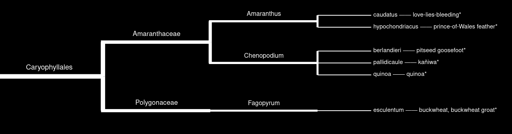

# Wikipedia Taxonomic Trees

Scrape taxonomic data from Wikipedia and generate interactive plots.  
Various taxonomic trees generated using the code can be viewed at my [website](https://kochjar.me/trees).

## Running instructions

Inside pythongenics.ipynb there's 3 cells
- Run the 3 cells in pythogenics.ipynb (may take some time, depending on article length)
- You can unzip the data.zip to avoid running first 2 cells (remember to put them in the working directory)
- Example plot options can be vieded at plot_options.ipynb

### Limitations
- Unfortunately, if you want to scrape a new article type, you will most likely have to update `scrape_initial_wiki_page()` because it seems nearly every Wikipedia article uses a different format.
- The scraping will be slow. On my 80Mb/s internet larger articles took about 25min.
- The plots can be quite laggy and buggy. Chromium seems to have less issues.
- Plots don't work too well on phones.